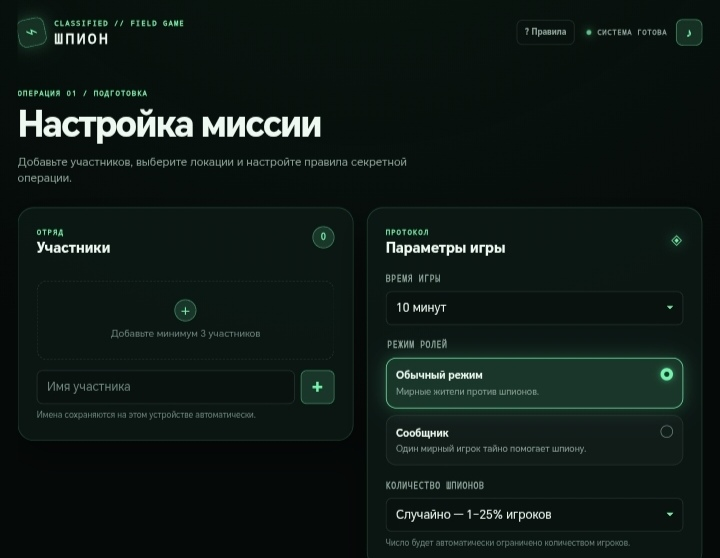

# 🕵️ ШПИОН // CLASSIFIED FIELD GAME

Интерактивная браузерная игра по мотивам настольной «Находка для шпиона». Чистый Vanilla JS без фреймворков, сборщиков и внешних библиотек. Оптимизирована под мобильные устройства.

## 🔗 Демо

**[Играть онлайн на GitHub Pages](https://tbeerse.github.io/whospy-game/)**

## ✨ Возможности

- 🎲 **TRNG на энтропии устройства** — генерация ролей и выбора локации на основе аппаратных показателей (клики, память, батарея, язык системы, `crypto.getRandomValues`)
- 💰 **Экономика и ранги** — баланс коинов между играми: Должник Синдиката (наценка +20%), Агент под прикрытием, Элита МИ-6 (скидка 10%)
- 🛒 **Магазин снаряжения** — радары локаций, глушитель, фальшивое удостоверение, детектор лжи, страховка. Предмет замораживается, если роль не подошла
- ⚡ **Случайные события** — кризис, охота за головами, анонимный благотворитель (шанс 15%)
- ⚖️ **Интерактивное судейство** — голосование, перехват локации, детектор лжи встроены в экран игры
- 🔊 **Процедурный звук** — эффекты генерируются через Web Audio API, без аудиофайлов
- 🌍 **Пул локаций** — выбор нескольких локаций перед игрой, игра случайно выбирает одну
- 📦 **Кастомные паки** — создание собственных локаций и ролей
- 📱 **Полностью адаптивная вёрстка** — mobile-first, от 320px
- ♿ **Доступность** — ARIA, фокус-стили, `prefers-reduced-motion`
- 🌙 **Тёмная тема** — неоновый зелёный на глубоком тёмном фоне

## 🛠 Технологии

- **HTML5** — семантическая вёрстка, `<dialog>`, ARIA
- **CSS3** — `@layer`, CSS-переменные, Grid, Flexbox, media queries
- **JavaScript (ES Modules)** — модульная архитектура без фреймворков
- **Web Audio API** — процедурный звук
- **localStorage** — сохранение игроков, балансов, гаджетов, настроек
- **GitHub Pages** — хостинг

## 🚀 Установка и запуск

### Клонировать репозиторий

    git clone https://github.com/TbeerSe/whospy-game.git
    cd whospy-game

### Запустить локальный сервер

Для работы ES-модулей нужен HTTP-сервер (из-за политики безопасности браузера `file://` не подойдёт).

    python -m http.server 8000

или через Node.js:

    npx serve .

Затем открой http://localhost:8000 в браузере.

## 📁 Структура проекта

    whospy-game/
    ├── index.html
    ├── css/
    │   ├── main.css          # точка входа, порядок @layer
    │   ├── tokens.css        # CSS-переменные (цвета, шрифты, тени)
    │   ├── reset.css         # сброс стилей
    │   ├── base.css          # доступность, фоновые эффекты
    │   ├── layout.css        # каркас: shell, header, screens, panels
    │   ├── components.css    # кнопки, формы, модалки, toast
    │   ├── animations.css    # все @keyframes
    │   ├── responsive.css    # медиа-запросы
    │   ├── utilities.css     # служебные классы
    │   └── features/
    │       ├── players.css   # список игроков, ранги, бейджи
    │       ├── locations.css # табы паков, карточки локаций
    │       ├── audit.css     # экран аудита энтропии
    │       ├── dealing.css   # экран раздачи ролей
    │       ├── game.css      # игровой экран, таймер
    │       ├── judging.css   # интерфейс судейства
    │       ├── shop.css      # магазин снаряжения
    │       └── endgame.css   # финал раунда, дельта баланса
    ├── js/
    │   ├── main.js           # точка входа
    │   ├── core/
    │   │   ├── state.js      # единый источник состояния
    │   │   ├── dom.js        # ссылки на DOM, showScreen, openDialog
    │   │   ├── storage.js    # localStorage + настройки
    │   │   ├── audio.js      # Web Audio API, тумблер звука
    │   │   └── utils.js      # общие утилиты
    │   ├── features/
    │   │   ├── players.js    # реестр игроков
    │   │   ├── locations.js  # локации, кастомные паки
    │   │   ├── trng.js       # сбор энтропии, аудит, события
    │   │   ├── assignments.js # распределение ролей
    │   │   ├── gadgets.js    # инвентарь, активация гаджетов
    │   │   ├── economy.js    # балансы, ранги, начисления
    │   │   ├── dealing.js    # экран раздачи, радар локаций
    │   │   ├── timer.js      # таймер раунда
    │   │   ├── rounds.js     # финалы, начисления, сброс
    │   │   ├── judging.js    # голосование, детектор лжи, перехват
    │   │   ├── shop.js       # магазин снаряжения
    │   │   └── handlers.js   # все setupXxxHandlers + startMission
    │   └── constants/
    │       ├── locations.js  # стандартный пак локаций
    │       ├── gadgets.js    # каталог снаряжения
    │       └── events.js     # случайные события раунда
    ├── images/
    ├── README.md
    └── LICENSE

## 🏗 Архитектура

**CSS:** используется `@layer` для фиксации каскада без `!important`. Порядок слоёв: `tokens → reset → base → layout → components → features → utilities → responsive`. Любой стиль из нижнего слоя перебивает стиль из верхнего, независимо от специфичности.

**JS:** модульная архитектура с чётким разделением:
- `core/` — состояние, DOM, хранилище, аудио, утилиты
- `features/` — игровая логика (игроки, локации, роли, экономика, таймер, судейство)
- `constants/` — справочные данные (локации, гаджеты, события)

Циклические зависимости разорваны: `timer.js` не импортирует `rounds.js` — вместо этого через `setOnTimerExpired()` регистрируется колбэк из `main.js`. Аналогично `gadgets.js` не импортирует `players.js` — `renderPlayers()` вызывается снаружи.

## ⚙️ TRNG (True Random Number Generator)

Случайность в игре — не `Math.random()`, а **xorshift32 PRNG**, засеянный хешем (FNV-1a) от пула энтропии:
- точное время (`performance.now()` с микросекундами)
- заряд батареи и статус зарядки
- использование JS heap (`performance.memory`)
- координаты последнего клика/тапа
- разрешение экрана, язык системы, количество ядер
- `crypto.getRandomValues()`

Сид сохраняется в состоянии игры — выбор локации и распределение ролей детерминированы в рамках одного раунда.

## 📸 Скриншот

## 🗺 Планы по развитию

- [ ] Мультиплеер по сети (WebRTC или WebSocket)
- [ ] Режим «Только онлайн» без устройства-ведущего
- [ ] Кастомные роли для сообщника
- [ ] Экспорт и импорт кастомных паков (JSON)
- [ ] Режим «Турнир» с таблицей лидеров
- [ ] PWA-версия с офлайн-режимом

## 📄 Лицензия

[MIT](./LICENSE) © 2026 TbeerSe